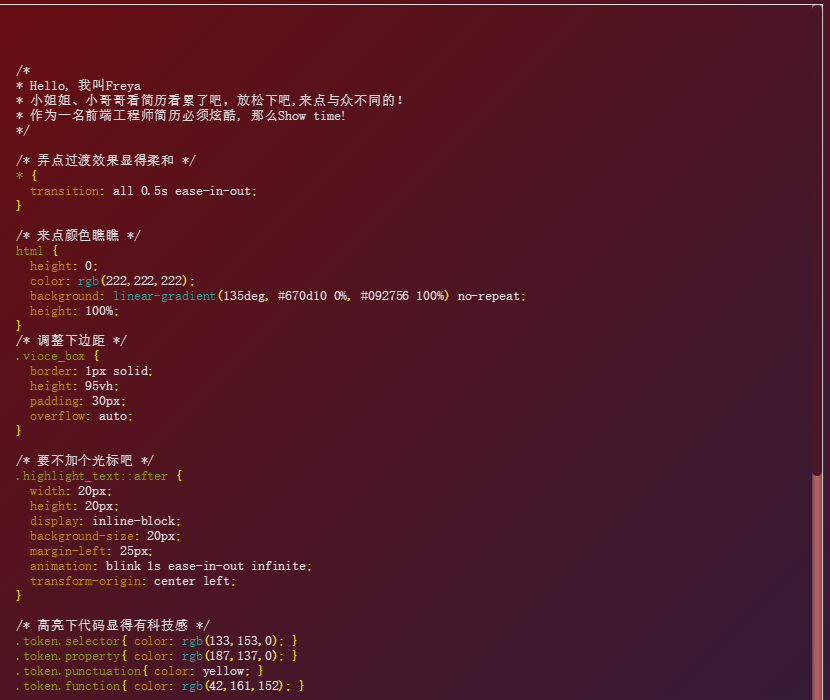

# Resume of Freya

As a professional front-end developer, a dynamic pure HMTL format resume presentation is necessary for us to show differentiation with others. It's funny for coding~ just check it out as following.

## Usages

```
npm install
npm run serve  # for dev
npm run build  # for production
```

### Preview

You can simply access the demo for preview:

[Click Me](https://freya1106.github.io/resume-preview/)

<p align="center">
  <a href="#" target="_blank" rel="noopener noreferrer">
    
  </a>
</p>

### LICENSE

[MIT](http://opensource.org/licenses/MIT)
